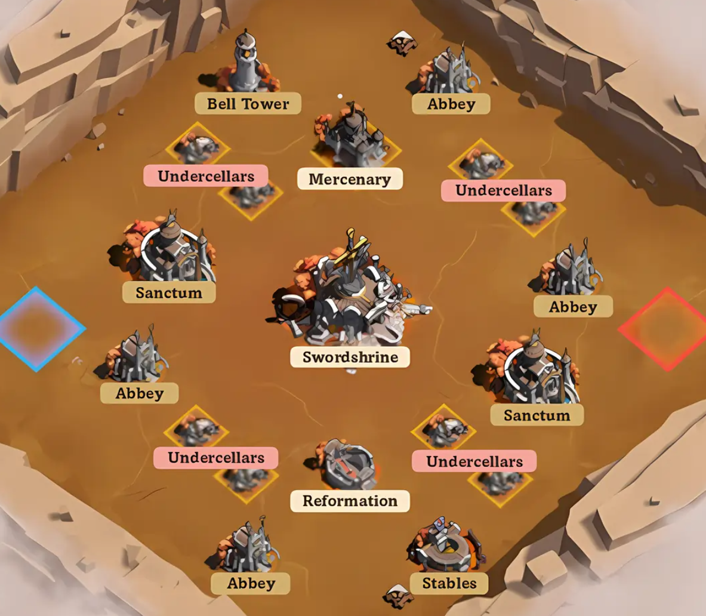

# Swordland Showdown Event

The event is split into phases.

## Registration

Swordland happens at set times during the day.  You need to be online to take part.  During registration you should vote for a time you're available.  The 2 most popular times will be allocated as Legion 1 and Legion 2.

After the times have been decided, you need to join one of the Legions.

At this time the R4 and R5 need to assign players to slots.  A max of 30 players can take part, with 10 reserve members.

You should confirm your registration for one of the Legions

## Matchmaking

After the legions are set up, the alliance will be matched against another, based on stats like troop strength, and previous history.

## Pre-Battle

Before the scheduled battle, you must withdraw all your troops, and make sure your infirmary is empty.

Once all your troops are home and healthy, you will be able to join the battlefield.  During the event your town cannot be attacked by normal players, it will look like you have a bubble activated.

## Battle

Phase 1: Fight for basic buildings like Sanctums, Abbeys, Bell Tower, and the Royal Stables.

Phase 2: Stronger buildings like the Swordshrine, Hall of Reformation, and Mercenary Camp become available.

Phase 3: Undercellars appear randomly.

## Buildings

### Swordshrine (Center)
The center of Swordland Showdown Map.
|  | First Control | Occupation |
| :--- | :---: | :---: |
| **Alliance Points** | 9,000 | +1,800/min |
| **Personal Points** | 4,500 | +900/min |

### Sanctums
Near the Swordshrine. Control both for even more points.
|  | First Control | Occupation |
| :--- | :---: | :---: |
| **Alliance Points** | 6,000 | +1,200/min |
| **Personal Points** | 3,000 | +600/min |

### Abbeys
Give points over time.
|  | First Control | Occupation |
| :--- | :---: | :---: |
| **Alliance Points** | 3,000 | +600/min |
| **Personal Points** | 1,500 | +300/min |

### Hall of Reformation
Boosts your combat power.
|  | First Control | Occupation |
| :--- | :---: | :---: |
| **Alliance Points** | 1,200 | +240/min |
| **Personal Points** | 600 | +120/min |

### Belltower
Speeds up building captures.
|  | First Control | Occupation |
| :--- | :---: | :---: |
| **Alliance Points** | 1,200 | +240/min |
| **Personal Points** | 600 | +120/min |

### Royal Stables
Shortens teleport cooldown by 50%.
|  | First Control | Occupation |
| :--- | :---: | :---: |
| **Alliance Points** | 1,200 | +240/min |
| **Personal Points** | 600 | +120/min |

### Mercenary Camp
Lets you send mercenaries to hit enemy buildings.
|  | First Control | Occupation |
| :--- | :---: | :---: |
| **Alliance Points** | 1,200 | +240/min |
| **Personal Points** | 600 | +120/min |

### Undercellars
Appear in waves—loot them for big point boosts.

## Strategy

Players must be online during the event to take part.  Players who register but don't turn up, will affect matchmaking (result in stronger enemies).

Use Squad chat during the event to coordinate attacks/defense.

R4/R5 can use labels or markers to direct players to targets.

At the beginning of the match, the strongest buildings are the Belltower and Royal Stables, so picking these first is useful.

Some players should focus on attacking/weakening the enemy to allow the defending team to focus on grabbing buildings.

Attacking players will need to take turns to allow troops to heal.

In the last 10 minutes of the game, focus on the Swordshrine using coordinated rallies.

Don't forget to activate any buffs, or pet skills before starting the event.

### Reward Maximization (Trading)
If you find yourself in a match with a friendly alliance of similar strength, you can "trade" buildings back and forth. This generates more loot crates for everyone and allows players to farm Personal Relic Points more efficiently.

### Guerilla Tactics (Losing Matchups)
If you clearly can't win the fight, you can still focus on your personal score.  Try to find isolated or weaker enemies, and cause damage, or scout for weaker or undefended buildings.  Capturing a building will spawn things you can collect for points, even if you can't hold the building very long.

## Tips and Mechanics

You get free heals and teleports as part of the event.  These are on cooldowns.  Beyond these, and you start eating into your own stock.

It also doubles in cost to use paid teleports, so using 3 paid teleports within 5 mins might end up using 7 advanced teleporters.

If you end up wiping out all your troops early, you can click 'Leave Battlefield'.  After 12 minutes your troops will be healed and you can rejoin.

Attacking the enemies' towns will cause the player to teleport away, this will cause them to leave the buildings they are garrisoned in.